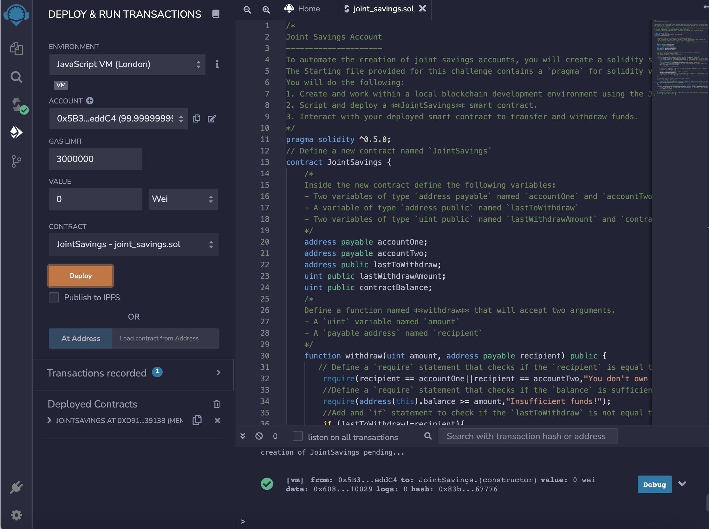
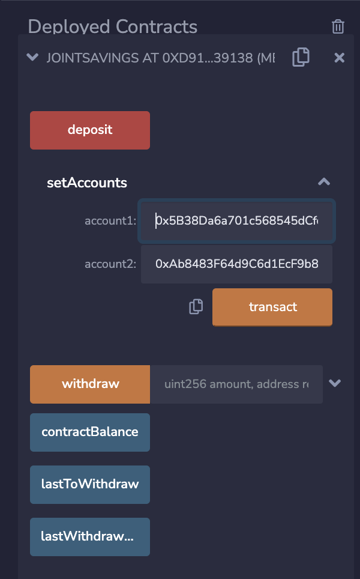
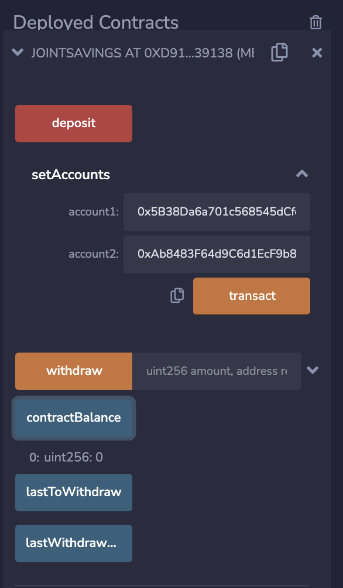
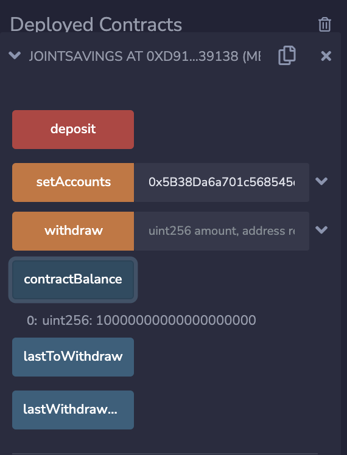
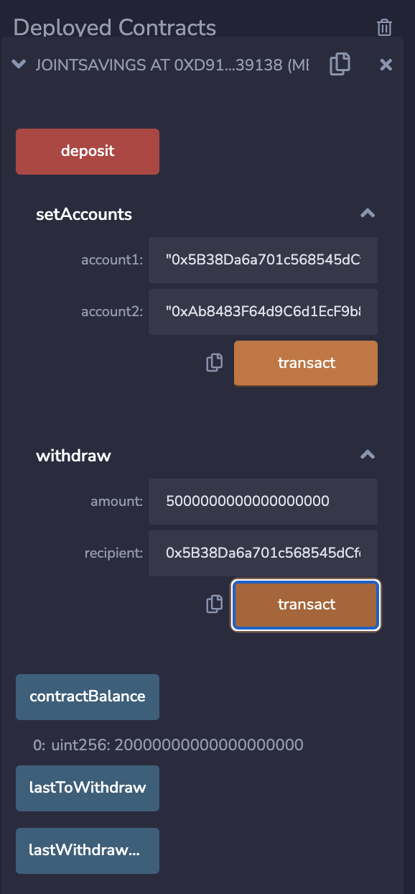
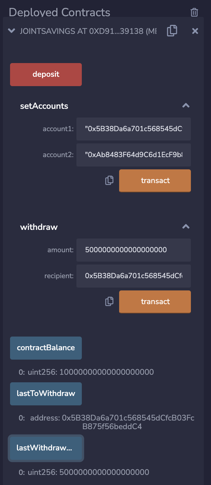

# Solidity-Joint-Savings-Account
Challenge / Project from Fintech Bootcamp for Solidity Smart Contracts Week

## Objective:

- Create Solidity Smart Contract using Remix IDE
- Compile Deploy the Smart Contract on a JavaScript VM
- Iteract with the Deployed Smart Contract
- Showcase the Screnshots about the interactions

## Solidity Smart Contract: 

**View the Code 👉 [joint_savings.sol](joint_savings.sol)**

- Fork This Github [Repository](https://github.com/nomadic-me/Solidity-Joint-Savings-Account)
- Open [Remix](https://remix.ethereum.org/) and Connect the Github Repo to Deploy
    - [Article to connect Github to Remix](https://medium.com/remix-ide/github-in-remix-ide-356de378f7da)
- Compile and Deploy smart contract to Javascript VM

## Interaction with Smart Contract

### Deploying Contracts

### Contract Balance

|  **Contract Balance - Initial** |  **Contract Balance - After Transfer** |
|---|---|
| The Balance is 0  |  Now the balance shows a Transfer from Accounts |
|   |   |

### Before Withdrawing and Last To Withdraw functions

|  **Before** |  **After Withdraw and LastToWithdraw** |
|---|---|
|   |   |